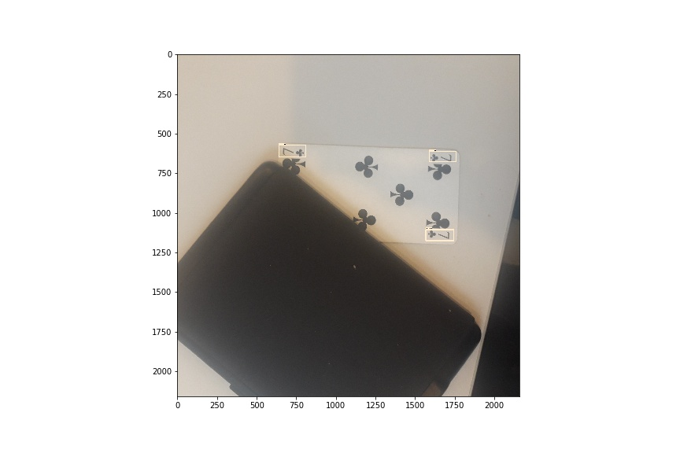
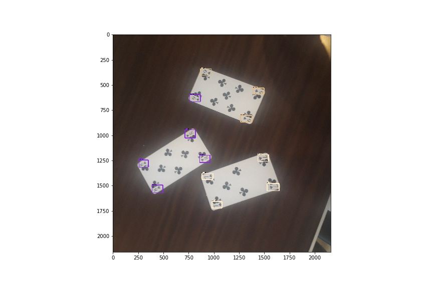
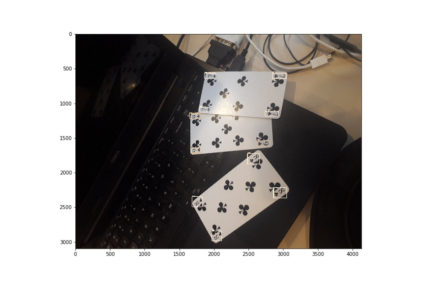
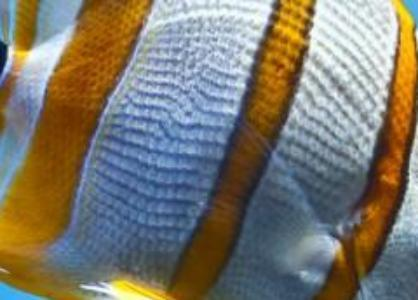
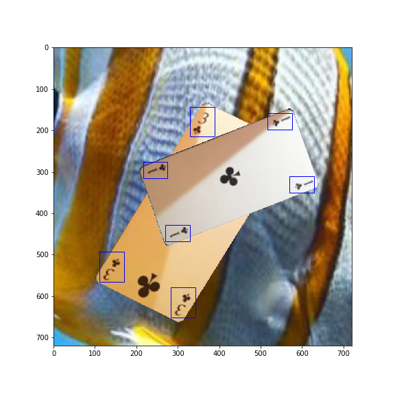
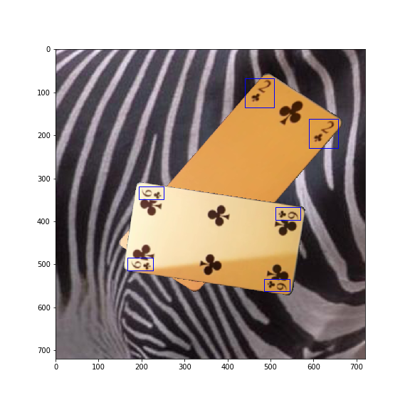

# CardDetection

<p align="center">
  
  
  
</p>


- [Installation](#Installation)

- [Generate dataset](#generate-dataset)
  * [Make videos with changing light conditions](#generate-dataset)
  * [Extract several frames for each card](#sub-heading)
  * [Download differents backgrounds](#download-background)
  * [Apply image transformations to each cards and put it randomly in randomly backgrounds](#augmentation)

- [Training](#training)
  * [Select proper model, depending in the application](#select-model)
  * [Modify .config and choose hyperparameters](#modify-config)
    + [Sub-sub-heading](#sub-sub-heading-1)
- [Heading](#heading-2)
  * [Sub-heading](#sub-heading-2)
    + [Sub-sub-heading](#sub-sub-heading-2)


# Installation

First we create a virtual environment with conda 
```
conda create -n venv pip python==3.6
```
Enter to virtual environment
```
source activate venv
```
Once inside, install al the requirements 

```file:///home/michel/Documents/GitHub/CardDetection/assets/bg_1.jpg
pip install -r requirements.txt
```
and create a new kernel with this environment

```
ipython kernel install --user --name=venv
```

Finally you have to add new path to PYTHONPATH environmenat variable 

add to .bashrc file and save:

```
export PYTHONPATH=$PYTHONPATH:<path/to/repo/>CardDetection/tensorflow/models/research:/<path/to/repo/>/tensorflow/models/research/slim
```

then

```
source .bashrc
```
# Project


## Generate dataset <a name="generate-dataset"></a>


  ### 1.1- Make videos with changing light conditions <a name="videos"></a>

In order to generate a useful dataset, we need a big amount of representative data.  Hence, one approach to this is to make videos for each card while changing light conditions. Then, we can quickly generate several pictures for each card.  

<p align="center">
  
</p>

  ### 1.2- Extract card image for each frame <a name="extract-card"></a>
  
To make the images more realistic, we have to change the background. We extract the card pixels from each image using Opencv.

<p align="center">
  
  
  
</p>

  ### 1.3- Download differents backgrounds <a name="download-background"></a>
  
We download different background from the web

<p align="center">
  
  
</p>

  ### 1.4- Apply image transformations to each cards and put it randomly in randomly backgrounds <a name="generate-dataset"></a>

We apply transformations such as traslation, rotation, perspective change, size and noise to each images. Then we choose randomly some images and one background and put it together

<p align="center">
  
  
</p>

## 2- Training <a name="training"></a>
For train the model we use [Tensorflow Object Detection API](https://github.com/tensorflow/models/tree/master/research/object_detection). 
With the images and their corresponding labels we genearte a .record file.

  ### 2.1 Select proper model, depending in the application  <a name="select-model"></a>
  
Once we have .record file we are ready to select a model. 
All the official tensorflow model are listed in the [zoo](https://github.com/tensorflow/models/blob/master/research/object_detection/g3doc/detection_model_zoo.md)
After try with several models we decide to keep only two:

 - **Faster-RCNN-inception-v2**: for "high-accuracy" application
 - **SSD-Mobilenet-v2**:  for "real-time" smartphone application

  ### 2.2 Modify .config and choose hyperparameters <a name="modify-config"></a>
To make the model working we have modify `pipeline.config`.

 - First, we change the number of classes in `num_classes: N`
 - Set ` fine_tune_checkpoint:path/to/model.ckpt` of the pretrained model .ckpt checkpoint 
 - Set `  label_map_path:"path/to/labelmap.pbtxt"` as the path of your labelmap.pbtxt file
 - Set `input_path:path/to/train.record to` to the path of your .record file

Previous changes are enough to start training. However, we can modify some hyperparameters to customize our training. For example, we can tune the *learning rate* and the  *batch size*

 - Decrease **learning rate** always tend to decrease training loss but requires more step to converge
 - **Batch size** define how many examples you use in each iteration.  You should reduce it if you are leading with RAM issues.

  
  ### 2.3 Train  !
  
To train use the following file.
 
## 3- Evaluate
  ### 3.1 
Evaluate trained real network with real images
